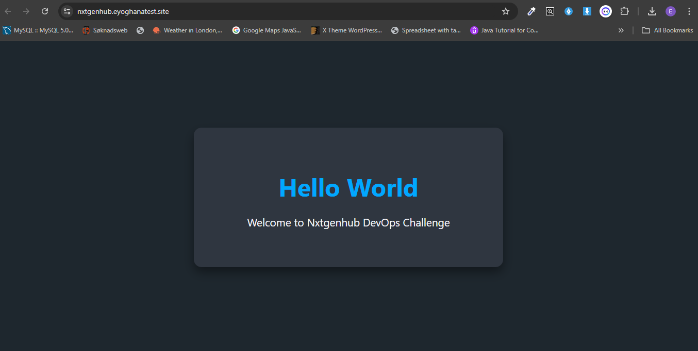
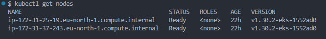
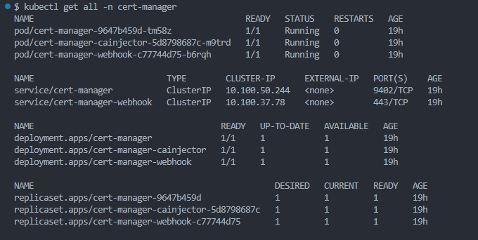
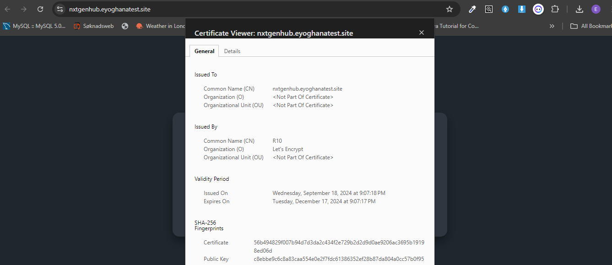
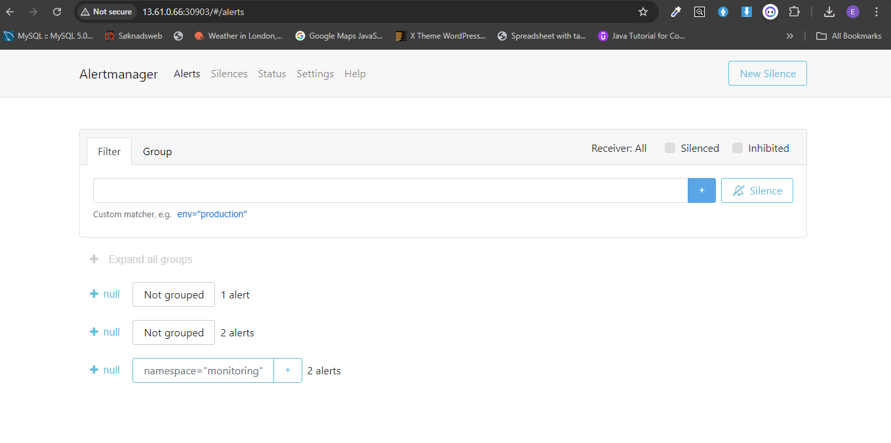
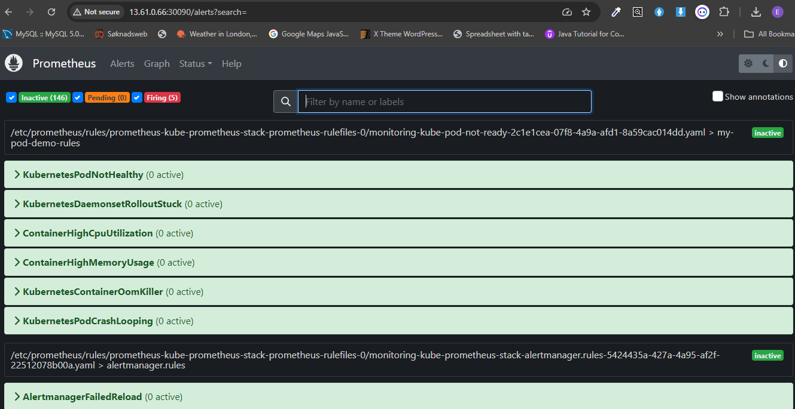
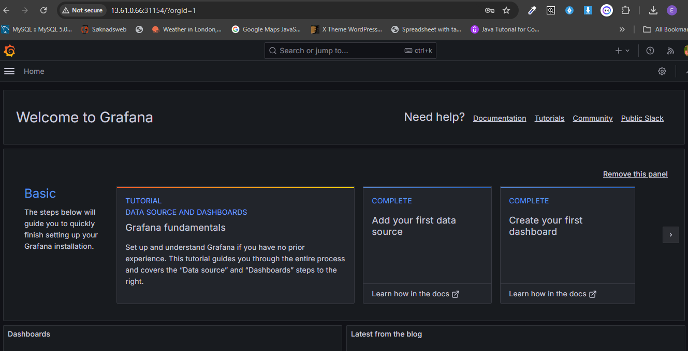
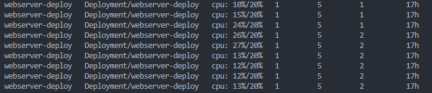

# Nxtgenhub DevOps Challenge

### Webserver built and deployed



## Overview

The **Nxtgenhub DevOps Challenge** is a project designed to demonstrate end-to-end DevOps skills. It involves creating a secure, containerized web server deployed onto a Kubernetes cluster. The solution includes Kubernetes manifests, Helm charts, application monitoring, logging and alerting, and TLS/SSL certificate management using cert-manager as well as an automated CI/CD pipeline.

### Key Features:

1. **Nginx Web Server**: A simple Nginx web server hosting a static webpage (`index.html`) which displays `Hello World`.
2. **Containerization**: The web server is containerized using Docker, and the image is hosted on Docker Hub.
3. **Kubernetes Deployment**: The application is deployed onto Kubernetes clusters using Docker Desktop and AWS EKS.
4. **Helm Charts**: Kubernetes manifests and Helm charts are created for simplified deployment and management.
5. **Ingress/Ingress Controller and HTTPS**: An ingress controller is set up to manage ingress resourses in order to expose the application outside the cluster or on the internet.
6. **PKI/Certificate Management**: Public Key Infrastructure/Certificate management for TLS certificates to enable secure communication over HTTPS.
7. **Monitoring & Logging**: Prometheus, Grafana, and Alertmanager are used for application monitoring, logging, and alerting.
8. **CI/CD**: Jenkins or GitHub Actions and ArgoCD are used to automate the CI/CD pipeline for deployments.

---

## Table of Contents

- [Setup Instructions](#setup-instructions)
- [Docker](#docker)
- [Kubernetes Setup](#kubernetes-setup)
- [Helm Chart](#helm-chart)
- [Ingress/Ingress Controller](#ingress)
- [Certificates Management](#certificates-tls)
- [Monitoring, Logging, and Alerting](#monitoring-logging-and-alerting)
- [CI/CD Pipeline](#ci-cd-pipeline)
- [Contributing](#contributing)

---

## Setup Instructions

### Prerequisites:

- **Docker** (for containerization)
- **Kubernetes** (e.g., Docker Desktop, AWS EKS, or AKS)
- **Helm** (for managing Kubernetes resources)
- **Cert-manager** (for automating HTTPS certificates)
- **Prometheus, Grafana, Alertmanager** (for monitoring and alerting)
- **Jenkins or GitHub Actions** (for CI/CD)
- **ArgoCD** (for GitOps-style deployments)

### Quickstart:

1. Clone the repository:

   ```bash
   git clone https://github.com/eyosolutions/nxtgenhub_challenge.git
   cd nxtgenhub_challenge/webserver/
   ```

2. Build the Docker image:

   ```bash
   docker build -t your-dockerhub-username/nxtgenhub-webserver:v1 .
   ```

3. Login to Docker Hub from the cli if not done already:

   ```bash
   docker login
   ```

4. Push the image to Docker Hub:
   ```bash
   docker push your-dockerhub-username/nxtgenhub-webserver:v1
   ```

---

## Docker

### Dockerfile Overview:

The `Dockerfile` defines the web server using an Nginx image and copies the static `index.html` page to the Nginx web root. Note that the `Dockerfile` itself uses the nginx digest instead of the image and tag to ensure the same image is pulled each time.

```Dockerfile
FROM nginx:1.27.1-alpine-slim
COPY index.html /usr/share/nginx/html
EXPOSE 80
CMD ["nginx", "-g", "daemon off;"]
```

### Local Testing:

To test locally, run:

```bash
docker run -d -p 80:80 your-dockerhub-username/nxtgen-webserver:v1
```

Navigate to `http://localhost` to view the web page.

---

## Kubernetes Setup

### Deployment on Docker Desktop:

Create a kubernetes cluster by doing the following:

- Install Docker Desktop following the instructions on their official website for your local machine.
- Open Docker Desktop, go to settings, click and enable kubernetes, and click on "Apply & restart".

### Deployment on EKS:

Create a kubernetes cluster on AWS using EKS by doing the following:

1. Create an AWS account if you do not have already. Setup IAM user and create access keys for the IAM user.
2. Install AWS CLI on your local machine and configure it with the access keys and default region.
3. While still in the root directory of this project, navigate and edit the `createk8sCluster.sh` script.

   ```bash
   cd k8s/aws_eks_option/
   ```

4. Edit the script with your own details (cluster name, subnet_IDs, securityGroup_ID, etc) and run the script.

   ```bash
   ./createk8sCluster.sh
   ```

5. Once done with the project, the cluster can be deleted by running the `deleteEKSCluster.sh` script.

   ```bash
   ./deleteEKSCluster.sh
   ```

### EKS Cluster Nodes



---

## Helm Chart/ Manifests

The Helm chart for the application automates the deployment of the web server, services, and ingress. The Ingress controller is added as a Helm dependency. There is also a separate `manifests` directory for the deployment of resources using `kubectl`.

### Using kubectl

1. Replace the namespace with your namespace or delete `-n <namespace>` to use the default.

   ```bash
   cd nxtgenhub_challenge/k8s/manifests/

   kubectl appply -f . -n <namespace>
   ```

2. Install the ingress controller of your choice. Ingress-nginx was used but traefik ingress controller is also an option.

   ```
   kubectl apply -f https://raw.githubusercontent.com/kubernetes/ingress-nginx/controller-v1.11.2/deploy/static/provider/cloud/deploy.yaml
   ```

3. For EKS, ensure the hostname in the ingress resources is valid and configured in AWS Route53 and the record points to the loadbalancer. Access the application using the hostname.

4. For Docker Desktop, add the hostname in the ingress resource to the /etc/hosts on linux or C:\Windows\system32\drivers\etc\hosts on Windows. Access the application from the browser using the hostname.

### Using Helm Chart

1. Install the Helm chart. Note that the ingress controller is added to the chart as a dependency. Install the chart onto the cluster. Replace the namespace with your namespace or delete `-n <namespace>` to use the default.

   ```bash
   cd nxtgenhub_challenge/k8s/helm-webserver/
   helm dependency update .
   helm upgrade --install webserver . -n <namespace>
   ```

2. To upgrade the application:

   ```bash
   helm upgrade nxtgenhub . -n <namespace>  #OR
   helm upgrade --install webserver . -n <namespace>
   ```

---

## Ingress/ Ingress Controller

The ingress resource and ingress controller installation are part of the manifests or the helm chart to manage single installation of the application. Ingress-nginx controller is used but traefik can also be used. The TLS termination is done on the ingress resource by the certificate management resources.

In EKS, the ingress triggers the provisioning of an internet facing external loadbalancer to direct traffic to the application.
Ingress-nginx can be installed separately when using the manifests/kubectl option, either by `kubectl` or `helm`.

NOTE: Below assumes ingress controller is `NOT` installed as a dependency of the application helm chart.

### Ingress-nginx Ingress Controller

```
kubectl apply -f https://raw.githubusercontent.com/kubernetes/ingress-nginx/controller-v1.11.2/deploy/static/provider/cloud/deploy.yaml

#OR Using Helm

helm repo add ingress-nginx https://kubernetes.github.io/ingress-nginx
helm repo update
helm upgrade --install ingress-nginx ingress-nginx \
--repo https://kubernetes.github.io/ingress-nginx \
--namespace ingress-nginx --create-namespace
```

### Traefik Ingress Controller

```
helm repo add traefik https://traefik.github.io/charts
helm repo update
helm install traefik traefik/traefik
```

---

## Certificate/TLS Management

Cert-manager is used in conjunction with Letsencrypt certificate issuer to manage the creation, termination and renewal of certificates in the cluster for the applications or cluster resources.

### Install cert-manager and Cluster Issuer

1. Install cert-manager
   **Using kubectl**

   ```
   kubectl apply -f https://github.com/cert-manager/cert-manager/releases/download/v1.15.3/cert-manager.yaml
   ```

   **Using Helm**

   ```
   helm repo add jetstack https://charts.jetstack.io --force-update
   helm install \
   cert-manager jetstack/cert-manager \
   --namespace cert-manager \
   --create-namespace \
   --version v1.15.3 \
   --set crds.enabled=true
   ```

### Cert-manager Installed



2. Install Letsencrypt Cluster-Issuer for staging. This is for development and testing purposes. The Cluster issuer use one of `http01` or `dns01` as a solver challenge.

   ```bash
   cd nxtgenhub_challenge/k8s/certificate_management/using_http01/
   kubectl apply -f staging-issuer.yaml -n <same-namespace-as-webserver>
   kubectl get certificate -n <same-namespace-as-webserver>
   ```

3. Once certificate shows ready, it can be confirmed by accessing application on the browser. Else, use `kubectl describe certificate` to troubleshoot to know the cause of issue and resolve it.

4. Install Letsencrypt Cluster-Issuer for production once everything is fine.

   ```bash
   cd nxtgenhub_challenge/k8s/certificate_management/using_http01/
   kubectl apply -f prod-issuer.yaml -n <same-namespace-as-webserver>
   kubectl get certificate -n <same-namespace-as-webserver>
   ```

5. Ensure the annotation of the ingress resource points to the cluster issuer

### TLS Certificate Issued



---

## Monitoring, Logging, and Alerting

Monitoring is required to get metrics about the cluster and the applications running in the clusters. These metrics can be used to trigger pod autoscaling and other needs.

### Monitoring Setup:

1. **Prometheus** collects metrics from the application.
2. **Grafana** provides visualization dashboards for these metrics.
3. **Alertmanager** sends alerts based on defined Prometheus rules.

- Install `metric-server` to get cluster core metrics:

  ```
  helm repo add metrics-server https://kubernetes-sigs.github.io/metrics-server/
  helm upgrade --install metrics-server metrics-server/metrics-server \
  --namespace monitoring \
  --create-namespace
  ```

- Install `prometheus, alertmanager and grafana stack` for metrics scrapping, visualizations and alerting.

  ```
  helm repo add prometheus-community https://prometheus-community.github.io/helm-charts
  helm repo update
  helm upgrade --install kube-prometheus-stack prometheus-community/kube-prometheus-stack -f custom_values.yaml \
  --version 62.7.0 \
  --namespace monitoring \
  --create-namespace
  ```

**Reference**:

1. https://medium.com/@muppedaanvesh/a-hands-on-guide-setting-up-prometheus-and-alertmanager-in-kubernetes-with-custom-alerts-%EF%B8%8F-f9c6d37b27ca

2. https://medium.com/@muppedaanvesh/a-hands-on-guide-to-kubernetes-monitoring-using-prometheus-grafana-%EF%B8%8F-b0e00b1ae039

**NOTE**: Access can be achieved by two ways:

1. Get the external IP of any of the worker nodes. Access prometheus, alertmanager and grafana from the browser using

   ```
   http://<node_external_ip>:<nodeport_for_each>
   ```

2. Use Lens App to port-forward or `kubectl port-forward` command to access the prometheus, alertmanager and grafana in the browser.

### Configuring Alertmanager

1. Create a custom alert called `custom_alert_rules.yaml` or use the one located at `nxtgenhub_challenge/k8s/monitoring_logging/` and deploy into the cluster.

   ```
   kubectl apply -f custom_alert_rules.yaml -n monitoring
   ```

### Alert Manager UI



For more custom alert rules, refer to https://samber.github.io/awesome-prometheus-alerts/rules#kubernetes

2. Test to see alertmanager is working by running as an example the below image with wrong tag; and monitor in alertmanager UI.
   ```
   kubectl run nginx-pod --image=nginx:lates3
   ```

### Configuring Prometheus

Prometheus can be configured to scrape more metrics from specific applications by updating the the config.yaml.

### Prometheus UI



### Configuring Grafana

1. Access from the browser using as described above.

2. Get login details. Get Username and Password from running the below two commands.

```
kubectl get secret --namespace monitoring kube-prometheus-stack-grafana -o jsonpath="{.data.admin-user}" | base64 --decode ; echo

kubectl get secret --namespace monitoring kube-prometheus-stack-grafana -o jsonpath="{.data.admin-password}" | base64 --decode ; echo
```

3. Go to dashboard and select `prometheus` as a data source and test. Import dashboards by using ID 11455 or other IDs from grafana library at https://grafana.com/grafana/dashboards/

### Grafana Home



### Configuring Prometheus to get metrics from the webserver and ingress-nginx controller

```
helm repo add prometheus-community https://prometheus-community.github.io/helm-charts
helm repo update
helm install prometheus-nginx-exporter prometheus-community/prometheus-nginx-exporter --version 0.2.2
```

### Alerts:

- Prometheus alerting rules are configured to detect common issues (e.g., high memory or CPU usage).
- Alerts are sent via email or Slack, depending on the configured alerting receiver system.

### Load Testing Autoscaling (HPA) functionality

```
kubectl run -i --tty load-generator --rm --image=busybox:1.28 --restart=Never -- sh -c "while sleep 0.01; do wget -q -O- http://<webserver_SVC_ip>; done"

kubectl get hpa webserver-deploy --watch
```

### Autoscaling with HPA Demo



---

## CI/CD Pipeline

### Jenkins or GitHub Actions:

- The CI pipeline builds the Docker image and pushes it to Docker Hub.
- The CD pipeline is triggered using **ArgoCD** to deploy the latest version to the Kubernetes cluster.

1. **Jenkins**: A Jenkins pipeline (`Jenkinsfile`) can be used for the CI to automate the docker build and push process.
2. **GitHub Actions**: Alternatively, GitHub Actions (`.github/workflows/ci.yml`) can be used to perform the same tasks.
3. **ArgoCD**: ArgoCD can be used to continously monitor changes in the manifests/helm chart repo and deploy the application onto the cluster.

---

## Contributing

Feel free to contribute by:

1. Submitting pull requests.
2. Opening issues on GitHub.
